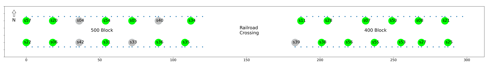

# Introduction
A modern Wi-Fi-enabled device (e.g., a smartphone) can spontaneously emit unencrypted and anonymized signals to the environment in search of an access point. This signal is called a probe request. Since it is freely available in the open air, one can build a sensor from a Wi-Fi adapter to capture the signal. Once captured, its signal strength can be measured in the form of a Received Signal Strength Indicator (RSSI).

RSSI is usually represented as a negative value in the unit of `dBm`. In theory, RSSI measurements are correlated with distance (the closer the Wi-Fi-enabled device is to a sensor, the larger the RSSI measurements). Thus, if multiple sensors are present near a Wi-Fi-enabled device when it emits probe requests, it is theoretically possible to predict the device's location based on statistical modeling of the RSSI measurements. And since smartphones are ubiquitous these days among pedestrians, RSSI-based localization via probe requests becomes a strong candidate for studying pedestrian mobility patterns on a city street in a low-cost, non-intrusive, and privacy-centric manner.

However, due to the fluctuating nature of RSSI measurements (RSSI can be affected by myriads of environmental factors such as humidity, obstruction, multi-path, interference, time, power variation, etc.), it is not trivial to model their behavior concerning device locations. In the literature, we have seen that past researchers had to build their own sensors and testbeds to evaluate new modeling ideas. This process is time-consuming and usually restricted to a controlled or small-scale outdoor environment. Neither is ideal to reveal the true performance of their models. It will benefit the research community if a dataset dedicated to real-world RSSI-based passive outdoor localization is publicly available. Unfortunately, to the best of our knowledge, such a dataset did not exist.

Not anymore! Here we present the West Palm Beach (WPB) dataset, whose sole purpose is for researchers to play with RSSI and location data collected in a real-world setting. We hope this dataset will allow faster iteration of model evaluation and benchmarking and invite more brainpower to tackle the RSSI-based passive outdoor localization problem.

# Data Collection

The WPB dataset was collected between 2022-11-08 and 2022-11-19 on the 500 (between Rosemary Ave and Quadrille Blvd) and 400 (between Quadrille Blvd and Dixie Hwy) block of Clematis Street, West Palm Beach, FL. It leveraged the MobIntel system, which is one of the testbeds of [The Center for Smart Streetscapes (CS3)](https://cs3-erc.org/).

The figure above shows the schematic of data collection. Each large colored circle represents a sensor. Green means the sensor was online during data collection; grey means offline. Each circle (sensor) is also labeled by its sensor ID. Notice that the sensors are aligned on the North and South sidewalk of the street because they were mounted on the light poles.

The blue dot represents the reference point (RP) where data collection occurred. At each RP, a researcher carried a Wi-Fi probe request emitter in his backpack and walked back and forth in the North-South direction of the sidewalk (sidewalk ONLY, the researcher never stepped onto the road). The researcher walked non-stop for 20 seconds, during which about 400 probe requests were emitted. This counts as one round of probe request emission. The researcher did three rounds at each RP on most days of data collection.

Once an RP was done, the researcher moved to the next one and repeated the same procedure. Two adjacent RPs are usually four meters apart, except when the next RP coincides with a sensor. Notice that only the East-West position of an RP is measured, not the North-South. This is because, on the scale of a city street, we are more interested in East-West positioning of a device along the sidewalk than North-South positioning within the sidewalk.

Details of the data collection procedure will be available in a future publication. If anyone has more questions now, please contact [Fanchen Bao](mailto:fbao2015@fau.edu).

# Data Description
The data itself is contained in the `wpb_dataset.zip` file, which consists of nine CSV files. Each file's name represents the date when the data was collected.

We recommend that one use the data collected on 2022-11-19 as test data because only one round of probe request emission was carried out at each RP. On all the other eight days, three rounds of probe request emissions took place at each RP.

Below is a snapshot of the data in each CSV file.

|   x |   sidewalk_x |   overall_x |   y |   class |   emitter |   lamp_post |   city_block |   label | timestamp   |   s57 |   s22 |   s11 | ... |
|----:|-------------:|------------:|----:|--------:|----------:|------------:|-------------:|--------:|:------------|------:|------:|------:|------:|
|   0 |           72 |         255 |   0 |       0 |         9 |           4 |          400 |      34 | 09:12:00    |   -95 |   -81 |   -72 |  ... |
|   8 |           52 |         239 |  15 |       1 |         9 |           2 |          400 |     300 | 11:04:38    |   -95 |   -95 |   -95 |  ... |
|   4 |          116 |         116 |  15 |       1 |         9 |           6 |          500 |     254 | 08:28:01    |   -80 |   -95 |   -95 |  ... |
|  16 |           52 |          52 |   0 |       0 |         9 |           2 |          500 |     169 | 10:01:30    |   -69 |   -70 |   -95 |  ... |
|  16 |           34 |          34 |   0 |       0 |         9 |           1 |          500 |     167 | 09:52:52    |   -53 |   -59 |   -84 |  ... |
|  ... |           ... |          ... |   ... |       ... |         ... |           ... |          ... |     ... | ...    |   ... |   ... |   ... |  ... |

## The Meaning of Each Column
* **x**: the distance between the RP and the nearest sensor to the West. This distance was measured and can be used as ground truth for modeling.
* **sidewalk_x**: the distance between the RP and the West-most sensor on the sidewalk (s57 for the 500 block North, s22 for the 500 block South, s11 for the 400 block North, and s39 for the 400 block South). This distance was measured and can be used as ground truth for modeling.
* **overall_x**: the distance between the RP and the West-most sensor of the 500 block (s57 for North and s22 for South). This distance is estimated as the width of the railroad crossing was not measured. We use it purely for visualization purposes.
* **y**: the "y-coordinate" of an RP. All RPs on the North have **y** value of 15, and all on the South have **y** value of 0. As explained before, the y-coordinate of an RP is meaningless; we use it purely for visualization purposes.
* **class**: an indicator whether the RP is on the North or South sidewalk. 1 = North, 0 = South.
* **emitter**: the ID of the emitter that sent the probe request. Three emitters were used, with IDs 9, 29, and 30.
* **lamp_post**: the index of the lamp post/sensor nearest to the RP on the West (i.e., the lamp post/sensor from which an RP computes the **x** value). The index starts from 0 on each sidewalk from the West and increases towards the East. For instance, s57 has index 0 and s34 has index 6; s39 has index 0 and s25 has index 6.
* **city_block**: the label for the city block where the RP resides. It has only two values: 500 or 400.
* **label**: the label for each round of probe request emission. All the rows (i.e., probe requests) that share the same **label** were emitted in the same 20-second round.
* **timestamp**: the timestamp of the starting time of each round of probe request emission. Note that all the rows that share the same **timestamp** also have the same **label** and that the **timestamp** does not record the time of each probe request but just the beginning of the emission round. That said, all the rows sharing the same **timestamp** are sorted in increasing chronological order.

## The Meaning of -95
-95 is a dummy value to fill in the places where a sensor failed to report an RSSI measurement. In other words, -95 is equivalent to missing data. One can choose any dummy value to replace missing data. We use -95 because it was used in previous literature.
